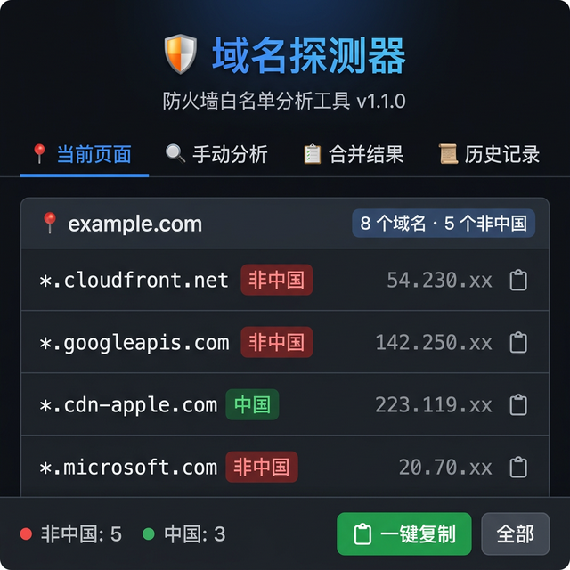
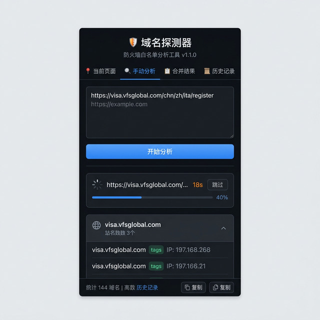

# 🛡️ 域名探测器 (Domain Detector)

> Chrome 浏览器扩展 — 分析网页第三方域名，识别非中国域名，用于防火墙白名单配置。

## 功能概览

| 功能 | 说明 |
|------|------|
| **自动捕获** | 浏览网页时自动记录所有网络请求的域名和真实 IP |
| **手动分析** | 支持批量输入 URL，后台自动打开分析（智能过滤非 URL 行） |
| **中国 IP 判定** | 内嵌 APNIC 中国 IP 段数据（4108 条），离线二分查找 |
| **代理环境支持** | 自动检测代理 IP，通过 DNS-over-HTTPS 解析真实 IP |
| **结果分组** | 按来源网站分组展示，域名按根域合并 |
| **跨站去重** | 合并多个网站的分析结果，自动去重 |
| **历史记录** | 自动保存分析结果，支持展开详情、加载到合并结果 |
| **一键复制** | 以 `*.domain.com` 格式复制非中国域名列表 |
| **行内复制** | 每个域名条目支持单独复制 |

## 界面预览

### 当前页面分析

自动捕获浏览中网页的所有第三方域名请求，实时分类中国/非中国。



### 手动批量分析

支持粘贴多个 URL（自动过滤聊天记录中的人名、时间戳等），带倒计时和跳过功能。



### 历史记录

自动保存每次分析结果，可展开查看详情或加载到合并结果中。


## 安装方式

### 开发者模式加载（推荐）

1. 下载或克隆本项目
2. 打开 Chrome，访问 `chrome://extensions/`
3. 开启右上角 **「开发者模式」**
4. 点击 **「加载已解压的扩展程序」**
5. 选择本项目文件夹

## 技术方案

- **Chrome Manifest V3** — 使用 Service Worker 架构
- **`chrome.webRequest.onResponseStarted`** — 获取请求的服务器 IP
- **DNS-over-HTTPS (DoH)** — 代理环境下通过 AliDNS / Cloudflare 解析真实 IP
- **APNIC CN IPv4 数据** — 4108 条合并段，二分查找，完全离线
- **`chrome.storage.local`** — 历史记录持久化存储（最多 50 条）
- **无外部依赖** — 所有资源本地化，离线可用

## 项目结构

```
domain-detector/
├── manifest.json            → 扩展配置 (Manifest V3)
├── background.js            → Service Worker，网络请求监听 + DNS 解析
├── china_ip.js              → 中国 IP 段数据（96KB，自动生成）
├── popup.html               → 弹出窗口 HTML
├── popup.css                → 样式（GitHub 风格深色主题）
├── popup.js                 → 弹出窗口交互逻辑
├── icons/                   → 扩展图标 (16/48/128px)
├── scripts/
│   ├── build_china_ip.js    → APNIC 数据处理脚本
│   └── apnic_data.txt       → APNIC 原始数据（.gitignore）
├── doc/
│   ├── progress.md          → 开发进展文档
│   └── images/              → README 截图
├── .gitignore
└── README.md
```

## 更新中国 IP 数据

如需更新 IP 数据库：

```bash
# 下载最新 APNIC 数据
curl -o scripts/apnic_data.txt https://ftp.apnic.net/stats/apnic/delegated-apnic-latest

# 重新生成 china_ip.js
node scripts/build_china_ip.js
```

## 权限说明

| 权限 | 用途 |
|------|------|
| `webRequest` | 监听网络请求获取域名和 IP |
| `webNavigation` | 追踪页面导航 |
| `storage` | 保存历史记录 |
| `activeTab` | 获取当前标签页信息 |
| `tabs` | 手动分析时在后台打开标签页 |
| `scripting` | 脚本注入（备用） |
| `<all_urls>` | 监控所有 URL 的网络请求 |

> 本扩展**不收集、不上传**任何用户数据。所有分析均在本地完成。

## 版本历史

### v1.1.0 (2026-03-09)
- 修复代理环境下 IP 全部显示 127.0.0.1 的问题
- 新增 DNS-over-HTTPS 真实 IP 解析
- 新增历史记录功能
- 新增分析倒计时、进度条、跳过按钮
- 新增行内复制按钮
- 新增 URL 智能过滤
- 修复轮询无限循环 bug
- 更换为 GitHub 风格专业配色

### v1.0.0 (2026-03-09)
- 初始版本
- 自动捕获 + 手动分析 + 合并结果
- 中国 IP 离线判定
- 一键复制非中国域名

## 许可证

本项目仅供个人使用。
